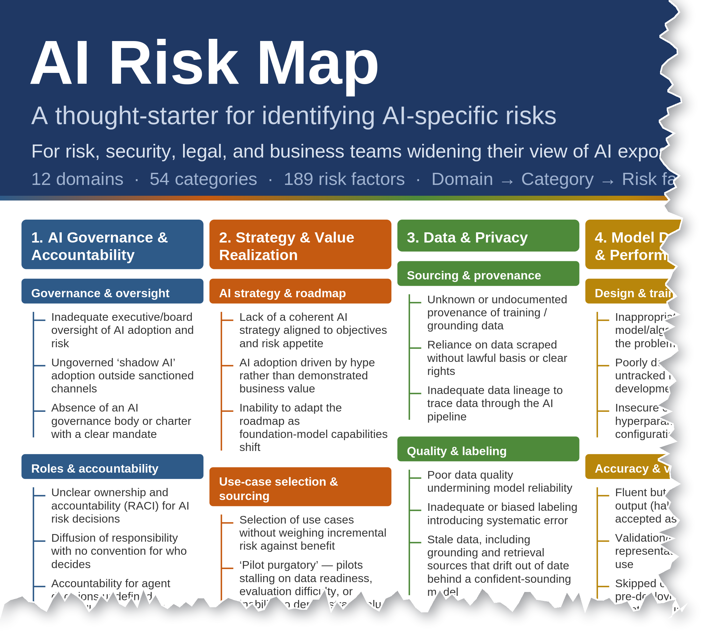

# AI Risk Map

*Detail of the upper-left. The full poster is [`AI-Risk-Map-v1.0.pdf`](AI-Risk-Map-v1.0.pdf) (print-ready) or [`.png`](AI-Risk-Map-v1.0.png).*

**A single-page visual reference built to improve the quality of AI risk conversations.**

Most teams naturally gravitate toward familiar concerns like hallucinations, prompt injection, and bias. But AI risk extends well beyond the usual talking points. The AI Risk Map helps teams quickly widen their perspective, surface blind spots, and identify overlooked risks before moving into deeper analysis.

It is not a risk library or exhaustive catalog. It is a practical tool designed to spark better conversations and uncover overlooked risks.

12 domains · 54 categories · 189 risk factors · one page.

---

## What's in this repository

| File | What it is | Use it when |
|---|---|---|
| `AI-Risk-Map-v1.0.pdf` | The poster. Print-ready at 48×36 in (ARCH E). | You want it on the wall, or in the workshop. |
| `AI-Risk-Map-v1.0.png` / `.svg` | Same poster, raster and vector. | Slides, intranet pages, editing the graphic. |
| `AI-Risk-Map-Taxonomy-v1.0.xlsx` | The workbook: every factor with its ID, source provenance, cross-references, scope decisions, and version history. | You want to see *why* something is or isn't on the map. |
| `AI-Risk-Map-v1.0.md` | The full corpus in one markdown file — factors plus all the reasoning, with a self-contained header. | You want to load the map into your own AI assistant and ask it questions. **Start here if you do that.** |
| `AI-Risk-Map-v1.0.csv` | Flat table, one row per factor, frozen nine-column schema. | You are mapping controls, tools, or systems to the map programmatically. |
| `AI-Risk-Map-v1.0-preview.png` | Cropped detail used at the top of this page. | Social posts, slides — a readable teaser. |
| `LICENSE` | CC BY-SA 4.0 legal text. | |

## How the map is organized

**By who owns the risk, not by how the technology works.** The twelve domains are enterprise functions — governance, strategy, data, model development, security, safety, operations, legal, third-party, workforce, financial, and autonomous action. A CFO, a general counsel, and a security lead can each open it and find themselves in it.

Three tiers: Domain → Category → Risk factor. Each risk factor is a condition, failure mode, or event that contributes to risk. It is not a scored risk, and it is not a control.

**Scope.** The map covers risk arising from *your organization's own adoption of AI*. Risk arising from *others' use of AI against you* — AI-enabled fraud, deepfake impersonation, adversarial automation — is deliberately out of scope. That risk is real; it belongs on your threat register, not on an adoption map. The scope decisions sheet in the workbook records this and every other deliberate exclusion.

**What gets in.** The map does not list every risk that applies to managing an AI system. It lists the risks that AI *introduces*, or that AI *amplifies* in a specific and nameable way. Generic IT, cyber, and vendor risk that exists identically without AI stays off; that one constraint is what keeps the map finite. A candidate earns a place by clearing any one of three gates:

| Gate | Test |
|---|---|
| **AI-specific** | Remove AI and the risk vanishes. |
| **Management delta** | The risk is not new, but the way it must be managed is. The delta has to be specific — *"agent-framework sprawl outpacing credential governance"* qualifies; *"cyber risk went up"* does not. |
| **Corroboration** | Two or more independent AI standards name it. |

Passing a gate is admission, not priority. When there were more good candidates than the page could hold, the tiebreak was how likely a competent team is to overlook the factor — because the poster exists to surface what gets missed, not to restate what everyone already tracks.

**Two-faced risks.** Many AI risks have an attack face and a condition face owned by different functions — data poisoning versus poor data quality, for example. The map routes each face to its owner and cross-references them (`»n` on the poster). They are split on purpose. Check the Cross-references sheet before reporting one as a duplicate.

## How to use it

**In a workshop.** Put it on the wall. Walk the room through it domain by domain and ask: which of these have we not discussed? The columns furthest from the room's expertise are where the value is.

**With your AI assistant.** Load `AI-Risk-Map-v1.0.md` into your tool of choice. Its header includes a copy-paste instruction block that keeps the assistant grounded in the map — answer only from this document, cite the factor ID, say plainly when something is not covered. Then ask things like *"We're deploying a customer-facing agent. Walk me through the factors we should discuss, domain by domain."*

**Programmatically.** Use the CSV. Every factor has a permanent identifier (`AIRM-001` … `AIRM-189`). IDs are flat, opaque, and stable across versions. Wording is not stable; cite the ID.

The column layout is frozen at v1.0 — adding, removing, or reordering a column is a major version. The contract:

| Col | Name | Notes |
|---|---|---|
| A | `ID` | `AIRM-nnn`. Never reused, never renumbered. Retired factors keep a tombstone row. |
| B | `Domain` | Tier 1 |
| C | `Category` | Tier 2 |
| D | `Risk factor — full description (L3)` | Authoritative wording. May change; cite the ID. |
| E | `Poster label` | Short form used on the poster |
| F | `Source(s)` | Semicolon-separated; notation in the workbook's Source key |
| G | `X-ref` | `→n` = another face of this risk is owned by domain n |
| H | `Status` | `active` / `retired` |
| I | `Superseded by` | Surviving ID after a merge |

Two-faced splits are authoritative on the workbook's **Cross-references** sheet, as factor-ID pairs in both directions. Use that, not the `X-ref` column, to avoid double-counting. Factor-level changes between versions are on the **Change log** sheet.

## Frequently asked

**Is this a control framework? Where are the controls?**
No, and deliberately. The map names risks and never controls — that is what keeps a one-page artifact from becoming a several-hundred-row control library. The stable `AIRM` identifiers exist precisely so you can map *your* control catalog, tool inventory, or architecture to it. That has already been done once: a separate project used the map as the validation standard for a 264-control catalog (all 247 controls in the CSA AI Controls Matrix plus 17 extensions), and the mapping is what showed the owner-based structure partitions cleanly between "security's job" and "someone else's job." If you build a controls mapping, the share-alike license means others can benefit from it too.

**Why isn't *X* on the map?**
Open the workbook's **Scope decisions** sheet first. It records what was deliberately excluded and why, what was challenged and kept, and what was considered and not added. If *X* isn't there, open an issue.

**Can I score or rank these?**
Not with what is here. Position, order, and ID number carry no meaning about likelihood or severity. A rare catastrophic factor sits beside a common minor one. Scope a factor into a proper risk scenario before you quantify it.

**Where do the factors come from?**
Every factor carries a source citation in the workbook and markdown. Sources span regulation (EU AI Act, Colorado), standards (NIST AI RMF and GenAI Profile, ISO/IEC 42001), threat frameworks (OWASP LLM / Agentic / AISVS, MITRE ATLAS, Databricks DASF), internal-control and financial-services guidance (COSO, CRI FS-AI-RMF, SR 11-7), practitioner frameworks (CSA AICM, Databricks AI Governance Framework), and academic taxonomies (MIT AI Risk Repository, International AI Safety Report, Weidinger, Shelby). Every one of the 189 factors is traceable. 98 carry the author's own framing of a risk a cited framework names (`…; Original`). 30 are named by no reviewed framework at all; those cluster in Strategy, Financial, and Workforce, which is where the map does work the technical frameworks do not.

**How is it validated?**
Crosswalked against 22 frameworks, regulations, and taxonomies; stress-tested through persona review and named-expert critique; reviewed by external practitioners; used as the validation standard for a separate 264-control catalog built on the CSA AI Controls Matrix; and put through a full citation audit before release in which every source locator was verified against the primary text and every `Original` tag was checked against every cited framework. The workbook's provenance appendix shows how many factors each source anchors.

**How do I cite it?**
> Wheeler, E. (2026). *AI Risk Map* v1.0. Licensed CC BY-SA 4.0. https://github.com/wheels344i-gte/ai-risk-map

Cite individual factors by ID: `AIRM-042`.

## Proposing changes

Proposals are welcome — **as Issues, not pull requests.** The files in this repository are generated from a single source that is not published here, so a pull request against the workbook, CSV, or markdown cannot be merged; it would be overwritten by the next build. Open an Issue instead. Every proposal is reviewed by the author against the three gates above and the Scope decisions sheet, and accepted changes appear in the next release with a row in the Change log.

A good proposal names the risk as a condition or failure mode (not a control), says which gate it clears, and checks that a neighboring factor does not already own it. Corrections to a citation are especially welcome: quote the source.

## License

© 2026 Evan Wheeler. Licensed under [Creative Commons Attribution-ShareAlike 4.0 International](https://creativecommons.org/licenses/by-sa/4.0/). You may share and adapt this work for any purpose, including commercially, provided you give attribution and license any derivative under the same terms. Full text in `LICENSE`.

Databricks DASF and the Databricks AI Governance Framework are © Databricks, licensed CC BY-SA 4.0. The MIT AI Risk Repository is licensed CC BY 4.0. The structure follows an established convention for one-page enterprise risk maps; that convention is format inspiration only, and no third party contributed AI risk content.
